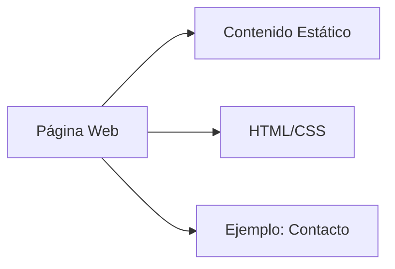
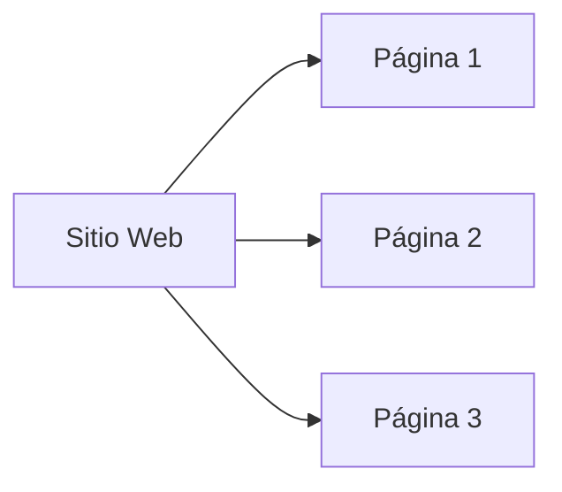
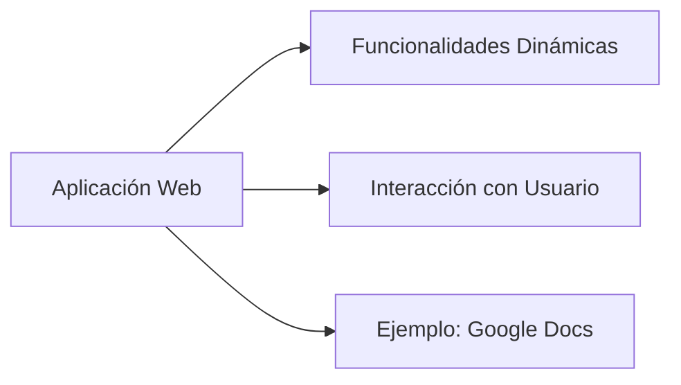
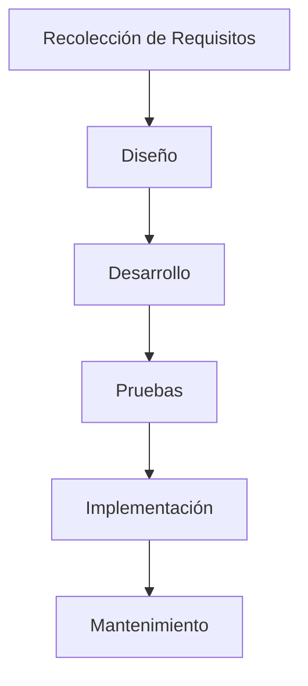
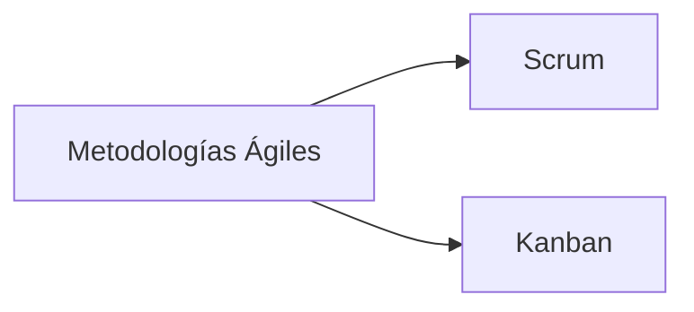
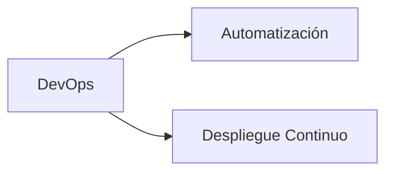
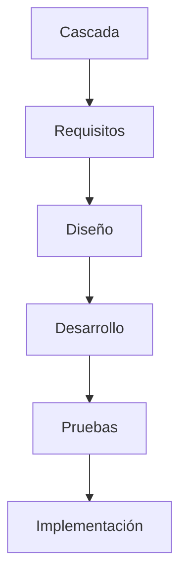

# Conceptos básicos de la web: HTTP, servidor y cliente

## Introducción

La web es una de las tecnologías más importantes de la actualidad, permitiendo la comunicación y el acceso a información a través de Internet. En esta documentación, exploraremos los conceptos básicos de la web y cómo funcionan sus componentes principales: HTTP, el servidor y el cliente.

---

## HTTP: Protocolo de Transferencia de Hipertexto

- **Qué es:** Protocolo que permite la comunicación entre el cliente y el servidor.
- **Cómo funciona:**
  1. El cliente realiza una petición HTTP.
  2. El servidor procesa la petición y envía una respuesta.
  3. La respuesta puede ser un documento HTML, un JSON, o un archivo.
- **Métodos comunes:**
  - GET: Obtener recursos.
  - POST: Enviar datos al servidor.
  - PUT: Actualizar recursos.
  - DELETE: Eliminar recursos.

---

## Cliente y Servidor

- **Cliente:**
  - Es el navegador o aplicación que realiza la petición.
  - Ejemplos: Google Chrome, Firefox, aplicaciones móviles.
- **Servidor:**
  - Es el sistema que recibe la petición y devuelve una respuesta.
  - Ejemplos: Apache, Nginx, servidores en la nube.

---

## Desarrollo Backend y Frontend en la actualidad

### Frontend

- **Qué es:** Desarrollo de la interfaz de usuario.
- **Tecnologías comunes:**
  - HTML, CSS, JavaScript.
  - Frameworks/Librerías: React, Angular, Vue.js.

### Backend

- **Qué es:** Desarrollo de la lógica del servidor y base de datos.
- **Tecnologías comunes:**
  - Lenguajes: Java, Python, PHP, JavaScript (Node.js).
  - Frameworks: Spring Boot, Django, Laravel, Express.js.

---

## Tecnologías y Herramientas

| Categoría                | Tecnologías                  |
| ------------------------ | ---------------------------- |
| **Frontend**             | HTML, CSS, React, Vue.js     |
| **Backend**              | Node.js, Spring Boot, Django |
| **Bases de datos**       | MySQL, MongoDB, PostgreSQL   |
| **Control de versiones** | Git, GitHub, GitLab          |

---

## Conclusión

La web funciona gracias a la comunicación entre el cliente y el servidor a través del protocolo HTTP. En la actualidad, el desarrollo web se divide en dos áreas principales: frontend y backend, cada una con herramientas y tecnologías especializadas. Conocer estos conceptos es fundamental para construir aplicaciones modernas y escalables.

# Aplicaciones Web, Páginas Web y Sitios Web

## Introducción
Las aplicaciones web han transformado la forma en que interactuamos con el mundo digital. Sin embargo, existe confusión entre los términos "páginas web", "sitios web" y "aplicaciones web". Además, el desarrollo de estas aplicaciones requiere un proceso estructurado y metodologías adecuadas para garantizar su éxito.

---

## Diferencias entre Páginas Web y Sitios Web

### Páginas Web
- **Definición:** Un documento único dentro de la web, accesible mediante un navegador y representado en HTML.
- **Características:**
  - Generalmente estática.
  - Contiene información específica.
  - Ejemplo: Una página de contacto o un artículo de un blog.

### Sitios Web
- **Definición:** Un conjunto de páginas web interrelacionadas que comparten un dominio común.
- **Características:**
  - Pueden ser estáticos o dinámicos.
  - Ofrecen información o servicios de manera estructurada.
  - Ejemplo: Un e-commerce, un blog o un portal de noticias.

### Aplicaciones Web
- **Definición:** Sistemas más complejos que permiten la interacción del usuario con funcionalidad avanzada.
- **Características:**
  - Dinámicas y centradas en el usuario.
  - Ejemplo: Sistemas de gestión, redes sociales o herramientas colaborativas como Google Docs.

---

## Ciclo de Desarrollo de Aplicaciones Web

El desarrollo de aplicaciones web implica varias fases estructuradas:

### 1. **Recolección de Requisitos**
- Entender las necesidades del cliente y los usuarios.
- Identificar las características principales de la aplicación.

### 2. **Diseño**
- Diseño de la experiencia de usuario (UX) y de la interfaz de usuario (UI).
- Creación de wireframes y prototipos visuales.

### 3. **Desarrollo**
- Implementación del frontend (interfaz del usuario).
- Creación del backend (lógica del servidor y bases de datos).
- Integración de servicios externos si es necesario.

### 4. **Pruebas**
- Verificar la funcionalidad y el rendimiento.
- Identificar y corregir errores o fallos.

### 5. **Implementación**
- Publicación en un servidor o en la nube.
- Configuración del entorno de producción.

### 6. **Mantenimiento**
- Actualizaciones regulares.
- Solución de errores reportados por los usuarios.
- Escalabilidad y mejora continua.

---

## Metodologías de Desarrollo Web en la Actualidad

### 1. **Metodologías Ágiles**
- **Scrum:**
  - Trabajo dividido en "sprints" (periodos cortos de tiempo).
  - Equipos multidisciplinarios.
  - Entregas constantes de funcionalidades.

- **Kanban:**
  - Enfoque en la gestión del flujo de trabajo.
  - Uso de tableros visuales para representar tareas.

### 2. **Metodología DevOps**
- Integración del desarrollo y las operaciones.
- Enfocada en la automatización y el despliegue continuo.
- Mejora la comunicación entre equipos.

### 3. **Metodologías Tradicionales**
- **Cascada:**
  - Proceso secuencial donde cada fase depende de la anterior.
  - Menos flexible que las metodologías ágiles.

---

## Conclusión
Entender las diferencias entre páginas web, sitios web y aplicaciones web es fundamental para abordar proyectos digitales de manera efectiva. El desarrollo de aplicaciones web sigue un ciclo estructurado y se apoya en metodologías modernas como ágil y DevOps, que permiten adaptarse a los cambios y mejorar la calidad del producto final.
